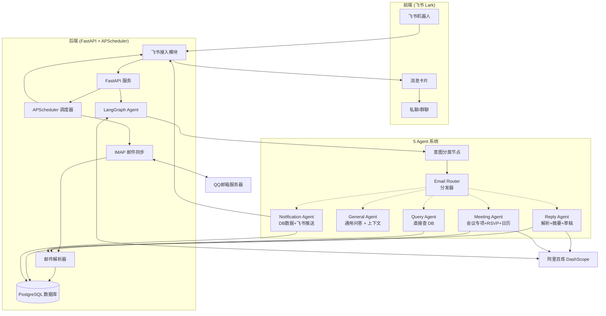

---
name: QQ邮箱智能生活事件助手
overview: 构建一个完整的QQ邮箱智能生活事件助手系统，后端使用Python 3.12 + FastAPI + APScheduler，飞书作为前端交互入口，实现邮件自动同步、解析、事件识别、提醒和飞书机器人对话的全链路功能。
todos:
  - id: data-process
    content: 数据处理阶段：Bug修复 + DB迁移 + Parser分类体系对齐 + 会议专项提取扩展
    status: pending
  - id: meeting-agent
    content: 实现 Meeting Agent（会议邀约解析 + RSVP + 日历事件生成）
    status: pending
  - id: meeting-router
    content: 扩展 _route_intent 加入 meeting 路由 + Email Router 分发器
    status: pending
  - id: notification-agent
    content: 扩展 Notification Agent（飞书卡片推送 + 多类型通知）
    status: pending
  - id: query-agent
    content: 扩展 Query Agent（分类筛选 + 时间范围 + 全文搜索）
    status: pending
  - id: reply-agent
    content: 扩展 Reply Agent（RSVP tone + meeting 场景支持）
    status: pending
  - id: feishu-platform
    content: 飞书开放平台准备：创建企业自建应用、获取 APP_ID/APP_SECRET、开启机器人能力、配置事件订阅
    status: pending
  - id: feishu-module
    content: 开发飞书基础模块（client.py / bot.py / events.py / handler.py）
    status: pending
  - id: feishu-business
    content: 业务逻辑接入：每日摘要推送改造、对话 Handler、事件通知
    status: pending
  - id: feishu-cleanup
    content: 清理前端代码：删除 frontend/、Dockerfile.frontend、更新 docker-compose.yml、移除 StaticFiles 挂载、更新文档
    status: pending
  - id: feishu-docs-test
    content: 文档更新与端到端测试
    status: pending
isProject: false
---

# QQ邮箱智能生活事件助手 - 实施计划

## 系统架构



## 一、后端项目结构

### 1.1 目录结构

```
backend/
├── app/
│   ├── api/              # API 路由
│   │   ├── __init__.py
│   │   ├── deps.py       # 依赖注入
│   │   ├── schemas.py    # Pydantic Schema
│   │   ├── routes_core.py    # 系统/设置 API
│   │   ├── routes_chat.py    # AI 对话 API
│   │   └── routes_agents.py  # Agent API
│   ├── feishu/            # 飞书接入模块（新增）
│   │   ├── __init__.py
│   │   ├── config.py     # 飞书配置加载
│   │   ├── client.py     # 飞书 API 客户端（Access Token 管理）
│   │   ├── bot.py        # 机器人消息推送（卡片/文本）
│   │   ├── events.py     # 飞书事件处理（消息回调、签名校验）
│   │   └── handler.py    # 消息处理器（路由到 LangGraph Agent）
│   ├── agents/           # AI 智能体
│   │   ├── __init__.py
│   │   ├── base.py       # Agent 基类
│   │   ├── agents.py     # [已废弃] 原 ReAct Agent，现统一走 LangGraph
│   │   ├── tools.py      # 工具注册表
│   │   ├── tools_impl.py # 工具实现
│   │   ├── memory.py     # 对话记忆
│   │   ├── email_reply.py # 邮件回复工具
│   │   └── graph/        # LangGraph 实现
│   │       ├── __init__.py
│   │       ├── state.py  # 状态定义
│   │       ├── nodes.py  # 节点定义
│   │       └── email_agent.py # Email Agent
│   ├── db/               # 数据库
│   │   ├── __init__.py
│   │   ├── database.py   # 连接管理
│   │   ├── models.py    # SQLAlchemy 模型
│   │   └── migrate.py   # 迁移脚本
│   ├── imap/             # IMAP 邮件收取
│   │   └── __init__.py
│   ├── parser/           # 邮件解析
│   │   └── __init__.py
│   ├── scheduler/        # 定时任务
│   │   └── __init__.py
│   ├── mailer/           # 邮件发送
│   │   └── __init__.py
│   ├── mcp/              # MCP 客户端
│   │   ├── __init__.py
│   │   ├── client.py    # MCP 客户端
│   │   └── notion_adapter.py # Notion 适配器
│   ├── core/             # 核心配置
│   │   └── __init__.py
│   ├── config.py         # 配置加载
│   ├── logger.py         # 日志配置
│   ├── main.py           # 应用入口
│   └── requirements.txt  # 依赖
├── docs/                 # 文档
└── data/                 # 数据目录（PostgreSQL）
```

### 1.2 核心模块设计

#### 1.2.1 配置管理 (app/config.py)

- 从 `.env` 加载所有配置（pydantic-settings）
- QQ邮箱 IMAP/SMTP 配置
- 阿里百炼 DashScope API 配置
- 调度间隔配置

#### 1.2.2 数据库模型 (app/db/models.py)

- `Email`: 原始邮件存储
- `Event`: 结构化事件（分类、抽取结果）
- `Memory`: AI 对话记忆（Notion 归档）

#### 1.2.3 IMAP 客户端 (app/imap/)

- IMAP + QQ邮箱授权码认证
- UID 增量拉取，避免重复
- MIME 解析提取主题、发件人、时间、附件

#### 1.2.4 邮件解析 (app/parser/)

邮件解析不再作为独立 Agent，而是**按需调用**的基础能力。各 Agent 按场景复用：

| 解析能力 | 归属 | 调用方式 |
|---------|------|---------|
| 通用 AI 分类（category） | Parser 层 | Meeting / Reply Agent 调用 `EmailParser.parse_email()` |
| 事件抽取（title / time / location） | Parser 层 | 同上 |
| 会议专项（organizer / attendees / link） | Meeting Agent 独享 | 正则 + LLM 二次确认 |
| 摘要生成 | Reply Agent 调用 | `EmailParser._build_prompt()` 扩展 |
| 已解析数据读取 | Notification / Query Agent | 直接查 DB（`is_processed=True`） |

- BeautifulSoup + lxml 清洗 HTML
- 纯文本提取（邮件正文）
- AI 内容分析（分类 + 事件抽取 + 摘要）

#### 1.2.5 AI Agent 系统 (app/agents/)

**架构**：基于 LangGraph Supervisor 的 5 Agent 编排系统。解析能力按 Agent 分散调用，不再独立串行。

##### 1.2.5.1 意图分类（classify_intent_node）

LLM 结构化输出判断用户意图，支持 6 种意图：

| 意图 | 说明 | 触发示例 |
|------|------|---------|
| `query` | 查询邮件/事件列表 | "查一下这周邮件" |
| `general` | 通用问答、问候 | "你好" |
| `reply` | 生成邮件回复草稿 | "帮我回复这封邮件" |
| `meeting` | 会议邀约处理 | "有个会议邀约帮我看看" |
| `notification` | 发送通知/摘要 | "发送每日摘要" |

##### 1.2.5.2 Email Router 分发器

意图分类后，由 `intent_router` 条件边将任务分发到对应 Agent：

```
意图分类
   │
   ├── intent=query ────────────→ Query Agent ───→ 直接查 DB（is_processed=True）
   │
   ├── intent=general ─────────→ General Agent ──→ 查上下文 + LLM 直接回答
   │
   ├── intent=reply ────────────→ Reply Agent
   │                                ├─ 调用 EmailParser（解析 + 摘要）
   │                                └─ 生成草稿 → interrupt 确认
   │
   ├── intent=meeting ─────────→ Meeting Agent
   │                                ├─ 调用 EmailParser（通用字段）
   │                                ├─ 会议专项提取（organizer / attendees / link）
   │                                ├─ RSVP 决策（Accept / Decline / Tentative）
   │                                └─ 日历事件写入 DB
   │
   └── intent=notification ────→ Notification Agent
                                     ├─ 读 DB 已解析数据（email.category / events）
                                     └─ 飞书卡片推送
```

##### 1.2.5.3 Query Agent（查询检索）

直接查 DB，不调用 AI。已解析邮件通过 `emails.is_processed=True` 过滤。

| 能力 | 说明 |
|------|------|
| 分类筛选 | `category=meeting` 查会议邮件 |
| 时间范围 | `start_date` / `end_date` 筛选 |
| 关键词全文搜索 | 利用 gin_trgm_ops 索引 |
| 会议专项查询 | 未回复的会议邀约（`events.rsvp_status=pending`） |

**边界**：最多 3 个筛选条件，结果上限 50 条。

##### 1.2.5.4 General Agent（通用问答）

查 DB 上下文（最近 5 封邮件/事件），结合 LLM 直接回答。不调用 Parser。

##### 1.2.5.5 Reply Agent（邮件回复）

1. 调用 `EmailParser.parse_email()` 获取摘要
2. 调用 `draft_email_reply` 工具生成草稿
3. interrupt 挂起 → 展示草稿 + [确认发送] / [取消]
4. 用户确认 → `reply_email` 真正发送

**RSVP tone 扩展**：`rsvp_accept` / `rsvp_decline` / `rsvp_tentative` 用于 Meeting 场景。

**自检**：`reflect_check_node` 检查草稿敏感信息 + 收件人地址。

##### 1.2.5.6 Meeting Agent（会议邀约）

**触发条件**：意图为 `meeting` 或分类为 `meeting` 的邮件。

**处理流程**：

```
1. 调用 EmailParser 提取通用字段（title / event_time / location / summary）

2. 会议专项提取（正则 + LLM 二次确认）
   ├─ meeting_link（正则：https?://[\S]+）
   ├─ organizer（From 字段 + 正文提取）
   ├─ attendees（正文提取，JSON 数组）
   └─ rsvp_deadline（正文截止时间）

3. RSVP 决策
   ├─ 检测邮件是否要求 RSVP
   ├─ 如需：生成 Accept / Decline / Tentative 草稿
   └─ interrupt 等用户确认

4. 日历事件写入 DB
   ├─ events 表新增字段：organizer / attendees / rsvp_status / meeting_link / calendar_event_id
   └─ status = "pending"（用户确认后改为 confirmed）
```

**RSVP 格式**：

```
ACCEPT:  "I am pleased to accept the meeting invitation for [title] on [date] at [time]."
DECLINE: "Thank you for the invitation, but I am unable to attend [title] on [date]."
TENTATIVE: "I may be able to attend [title] on [date], but need to confirm my schedule."
```

**边界**：不处理多日会议、不处理循环会议、不自动写入飞书日历。

##### 1.2.5.7 Notification Agent（主动通知）

两种触发场景：

| 场景 | 触发时机 | 通知内容 |
|------|---------|---------|
| 定时推送 | Scheduler 每日 09:00 | 分类统计 + 重要事件列表 |
| 实时事件 | 邮件解析完成 + 重要事件 | 单封邮件摘要卡片 |
| 会议提醒 | 会议开始前 N 分钟 | 会议详情 + RSVP 操作按钮 |
| RSVP 催办 | RSVP 截止前 24 小时 | 待回复会议邀约列表 |

**推送渠道**：飞书卡片（`feishu/bot.py`）。

**推送频率**：每用户每类通知每天上限 3 条。

##### 1.2.5.8 边界控制（明确排除）

| 排除项 | 原因 |
|--------|------|
| 账单/发票/付款处理 | 用户明确要求暂不做 |
| 审批流（审批卡片/审批人路由） | 超出 MVP 范围 |
| 企微/钉钉/其他 IM 接入 | 仅支持飞书 |
| 邮件附件解析 | 第二期考虑 |
| 飞书日历写入 | 推送卡片让用户手动加入日历 |
| 多日/循环会议 | 第一期不做 |
| 会议冲突自动改期 | 第一期仅告警，不自动改期 |
| 会议摘要/纪要生成 | 第二期考虑 |

#### 1.2.6 MCP 扩展 (app/mcp/)

- `client.py`: MCP 协议客户端（stdio 通信）
- `notion_adapter.py`: Notion 数据库归档适配器

#### 1.2.7 调度任务 (app/scheduler/)

- 邮件同步任务（可配置间隔）
- 每日摘要任务（固定时间推送）

## 二、前端项目结构

### 2.1 目录结构

```
frontend/
├── src/
│   ├── api/            # API 调用封装
│   │   ├── index.ts    # Axios 实例 + 拦截器
│   │   ├── types.ts   # API 类型定义
│   │   ├── emails.ts  # 邮件 API
│   │   ├── events.ts  # 事件 API
│   │   ├── chat.ts    # AI 对话 API
│   │   └── system.ts  # 系统 API
│   ├── pages/          # 页面组件 (.tsx)
│   │   ├── Layout.tsx     # 布局组件（Outlet）
│   │   ├── Dashboard.tsx  # 仪表盘
│   │   ├── Timeline.tsx   # 时间线
│   │   ├── Chat.tsx        # AI 对话助手
│   │   └── Settings.tsx   # 设置
│   ├── stores/         # Zustand 状态管理
│   │   ├── email.ts   # 邮件状态
│   │   └── event.ts   # 事件状态
│   ├── router/
│   │   └── index.ts    # React Router v6 配置
│   ├── App.tsx         # 根组件
│   └── main.tsx       # 入口
├── index.html
├── vite.config.ts
├── tsconfig.json
├── package.json
└── .env
```

### 2.2 页面设计

- **Dashboard**: 邮箱接入状态、统计卡片、最近事件
- **Timeline**: 按时间分类展示所有邮件和事件
- **Chat**: AI 智能对话助手（支持 Function Calling / LangGraph）
- **Settings**: QQ邮箱配置、AI配置、定时推送设置

## 三、实施步骤

### 第一阶段: 数据处理（数据先行）

> 目标：为 5 Agent 提供完整、可用的数据基础设施

#### 1.1 阻断性 Bug 修复

- `nodes.py` LLM 配置：替换 `settings.OPENAI_MODEL/OPENAI_API_KEY/OPENAI_BASE_URL` 为 `DASHSCOPE_MODEL/API_KEY/BASE_URL`

#### 1.2 数据库迁移

在 `configs/docker/postgres/init.sql` 和 `app/db/models.py` 中新增：

| 字段 | 表 | 类型 | 说明 |
|------|-----|------|------|
| `organizer` | events | VARCHAR(500) | 会议组织者 |
| `attendees` | events | TEXT（JSON 数组） | 参会人列表 |
| `rsvp_status` | events | VARCHAR(20) | pending / accepted / declined / tentative |
| `meeting_link` | events | VARCHAR(1000) | 线上会议链接 |
| `calendar_event_id` | events | VARCHAR(100) | 飞书日历事件 ID |
| `message_type` | chat_messages | VARCHAR(20) | intent / response / error |
| `agent_name` | chat_messages | VARCHAR(50) | 子 Agent 名称 |

#### 1.3 Parser 分类体系对齐

当前 7 类 → 对齐新 Agent：

| 原分类 | 新分类 | 变化说明 |
|--------|--------|---------|
| 社交 / 工作（会议相关） | **meeting** | 扩展为会议专项 |
| 购物 / 物流 | **logistics** | 订单/发货/签收 |
| 账单 | **其他** | 暂不处理 |
| 订阅 | **其他** | 归入其他 |
| 其他 | **general** | 通用类 |

新增 `meeting` 分类关键词：`会议` / `邀约` / `日程` / `schedule` / `calendar` / `参会` / `meeting` / `conference` / `webinar`。

#### 1.4 Parser 会议专项提取扩展

为 Meeting Agent 准备以下数据（正则优先 + LLM 二次确认）：

| 字段 | 提取策略 |
|------|---------|
| `meeting_link` | 正则：`https?://[\S]+`（匹配 http/https 链接） |
| `organizer` | From 字段 + 正文提取发件人 |
| `attendees` | 正文提取，JSON 数组存储 |
| `rsvp_deadline` | 正文截止时间 |

#### 1.5 数据链路验证

- IMAP 同步 → Parser 解析 → 存 DB 全链路测试
- 新增字段读写验证

---

### 第二阶段: Agent 实现（压后的后端开发）

#### 2.1 Meeting Agent

- 新增 `meeting_agent_node` LangGraph 节点
- 实现会议专项提取逻辑
- 实现 RSVP 决策（Accept / Decline / Tentative）
- 实现日历事件写入 DB
- 实现 interrupt 挂起（RSVP 确认）

#### 2.2 意图路由扩展

- `classify_intent_node` 支持 `meeting` 意图
- `_route_intent` 条件边加入 `meeting` 分发
- `intent_router` Email Router 分发器完善

#### 2.3 Notification Agent 扩展

- 读 DB 已解析数据（`email.category` / `events`）
- 飞书卡片推送（5 种通知类型）
- 推送频率控制（每类每天上限 3 条）

#### 2.4 Query Agent 扩展

- 分类筛选（`category=meeting`）
- 时间范围查询（`start_date` / `end_date`）
- 全文搜索（利用 gin_trgm_ops 索引）
- 会议专项查询（`rsvp_status=pending`）

#### 2.5 Reply Agent 扩展

- RSVP tone：`rsvp_accept` / `rsvp_decline` / `rsvp_tentative`
- Meeting 场景支持（看完解析 + 摘要后生成草稿）

---

### 第三阶段: 飞书接入（与第二阶段并行）

#### 阶段一：飞书开放平台准备（0.5 天）

1. 在[飞书开放平台](https://open.feishu.cn/app)创建企业自建应用
2. 获取 `APP_ID` 和 `APP_SECRET`
3. 开启**机器人**能力
4. 配置**消息事件订阅**（接收 `im.message.receive_v1` 事件）
5. 配置**请求网址验证**（回调 URL 验证）
6. 添加权限：`im:message`（读取消息）、`im:chat`（群相关）

> 注意：飞书机器人消息回调需要公网可访问的 HTTPS 地址（开发阶段可用 ngrok 内网穿透）。

#### 阶段二：飞书基础模块开发（1.5 天）

1. 新建 `backend/app/feishu/` 目录结构
2. 实现 `client.py`（飞书 API 客户端，Access Token 管理）
3. 实现 `bot.py`（消息推送：富文本卡片、文本消息、Markdown）
4. 实现 `events.py`（消息签名校验、URL 验证响应）
5. 新增 `POST /feishu/events` 回调端点
6. 更新 `config.py` 添加飞书配置字段
7. 编写飞书消息卡片模板（每日摘要、对话回复、事件提醒）

#### 阶段三：业务逻辑接入（1.5 天）

1. **每日摘要推送改造**：原来 `scheduler/` 调用 SMTP → 改为调用 `feishu/bot.py` 推送飞书卡片
2. **对话 Handler 接入**：飞书消息收到 → 路由到 LangGraph Agent → 结果通过飞书卡片返回
3. **事件通知接入**：重要事件（会议邀约、物流送达等）实时推送飞书消息
4. 确保 LangGraph 对话结果的格式适配飞书卡片（折叠长文本、分段展示）

#### 阶段四：清理前端代码（0.5 天）

1. 删除 `frontend/` 目录
2. 删除 `docker/Dockerfile.frontend`
3. 更新 `docker/docker-compose.yml` 移除 frontend 服务
4. 更新 `backend/app/main.py` 移除 `StaticFiles` 挂载
5. 更新 `README.md` 移除前端相关内容
6. 更新 `docs/AI_ENGINEERING_GUIDE.md` 移除 `frontend-architecture.md` 引用
7. 删除 `docs/frontend-architecture.md`

#### 阶段五：文档与测试（1 天）

1. 更新 `docs/feishu-integration.md`（从 planned → implemented）
2. 更新 `docs/backend-architecture.md` 添加 feishu 模块说明
3. 更新 `docs/plan.md` 实施阶段标记
4. 更新 `docker/deploy-aliyun.md` 移除前端部署说明
5. 端到端测试：
   - 飞书机器人对话测试（查询邮件、生成回复）
   - 每日摘要推送测试
   - 会议提醒推送测试
   - ngrok 本地开发穿透测试

## 四、技术栈

| 层级  | 技术                                                          |
| --- | ----------------------------------------------------------- |
| 后端  | Python 3.12, FastAPI, APScheduler, SQLAlchemy, Pydantic      |
| 前端  | 飞书（Lark）—— 机器人、消息卡片、私聊/群聊                    |
| 邮件  | imaplib, email, BeautifulSoup, lxml                         |
| AI  | 阿里百炼 DashScope (OpenAI 兼容接口), LangGraph, LangChain   |
| 数据库 | PostgreSQL                                              |
| 发送  | 飞书机器人推送（替代 SMTP）                                    |
| 扩展  | MCP (Notion 归档, EML Parser)                                |
| 容器  | Docker, Docker Compose                                       |

## 五、配置项 (.env)

```env
# QQ邮箱配置
QQ_EMAIL=your_email@qq.com
QQ_IMAP_HOST=imap.qq.com
QQ_IMAP_PORT=993
QQ_SMTP_HOST=smtp.qq.com
QQ_SMTP_PORT=465
QQ_AUTH_CODE=your_auth_code

# AI 配置 (阿里百炼 DashScope)
DASHSCOPE_API_KEY=your_api_key
DASHSCOPE_BASE_URL=https://dashscope.aliyuncs.com/compatible-mode/v1
DASHSCOPE_MODEL=qwen-plus

# 应用配置
APP_HOST=0.0.0.0
APP_PORT=8000
CHECK_INTERVAL_MINUTES=5
SCHEDULED_SEND_HOUR=9
SCHEDULED_SEND_MINUTE=0

# 可选：MCP 配置
# MCP_NOTION_COMMAND=uv
# MCP_NOTION_ARGS=--directory,/path/to/notion_mcp,run,notion_mcp.py
# MCP_NOTION_CWD=/path/to/notion_mcp
```

## 六、API 接口设计

| 方法 | 路径                               | 说明            |
| --- |--------------------------------|---------------|
| GET  | /api/emails                    | 邮件列表         |
| GET  | /api/emails/:id                | 邮件详情         |
| POST | /api/emails/sync               | 同步邮件         |
| POST | /api/emails/parse-all          | 解析所有未处理邮件   |
| GET  | /api/events                    | 事件列表         |
| GET  | /api/events/:id                | 事件详情         |
| POST | /api/chat                      | AI 对话（LangGraph）  |
| POST | /api/reply/draft/:email_id     | 生成回复草稿       |
| POST | /api/reply/send/:email_id      | 发送回复         |
| GET  | /api/settings                  | 获取设置         |
| POST | /api/settings/test-connection   | 测试 IMAP 连接    |
| GET  | /health                        | 健康检查         |

---

## 七、飞书接入重构计划

> 本计划描述将 MailLife 从 React 前端迁移到飞书接入的完整实施方案。

### 7.1 现状分析

#### 现有架构

```
QQ邮箱 ──IMAP──▶ 后端(FastAPI) ──▶ 前端(React SPA)
                    │
                 APScheduler 定时任务
                    │
              每日摘要 ──SMTP──▶ QQ邮箱（推送）
```

#### 现有前端职责

| 页面 | 核心功能 |
|------|---------|
| Dashboard | 邮箱状态、邮件/事件统计卡片 |
| Timeline | 邮件列表、分页、分类筛选 |
| Chat | AI 对话（调用 LangGraph /SSE） |
| Settings | IMAP/SMTP 配置、连接测试 |

前端本质是**数据展示 + 用户交互界面**，所有业务逻辑在后端。

#### 现有后端能力（已具备）

- IMAP 邮件同步
- AI 邮件解析（DashScope）
- LangGraph Agent（对话 + 意图路由）
- APScheduler 定时摘要推送
- SMTP 邮件发送
- REST API（`/api/emails`, `/api/events`, `/api/chat`, `/api/agents/langgraph/chat` 等）

### 7.2 目标架构

```
QQ邮箱 ──IMAP──▶ 后端(FastAPI) ──▶ 飞书(Lark)
                    │
                 APScheduler 定时任务
                    │
              每日摘要 ──飞书机器人──▶ 飞书群/私聊
```

用户**不再打开 Web 页面**，改为在飞书中：
- 收到每日摘要卡片（机器人推送）
- 通过机器人对话查询邮件/事件
- 通过机器人触发邮件回复确认

### 7.3 核心改动范围

#### 7.3.1 删除：前端（React SPA）

移除以下全部文件：

| 路径 | 说明 |
|------|------|
| `frontend/` 整个目录 | React 前端代码 |
| `backend/app/main.py` 中静态文件托管逻辑 | `StaticFiles` 挂载 |
| `docker/Dockerfile.frontend` | 前端镜像构建 |
| `docker/docker-compose.yml` 中 frontend 服务 | 容器编排 |
| `docs/frontend-architecture.md` | 前端架构文档 |

#### 7.3.2 新增：飞书接入模块

新增 `backend/app/feishu/` 模块：

| 文件 | 职责 |
|------|------|
| `config.py` | 飞书配置加载（APP_ID / APP_SECRET / Bot Token） |
| `client.py` | 飞书开放平台 API 客户端（获取/刷新 Access Token） |
| `bot.py` | 机器人消息推送（富文本卡片、文本消息） |
| `events.py` | 飞书事件处理（消息回调接收、消息校验） |
| `handler.py` | 消息处理器（路由到 LangGraph Agent） |

#### 7.3.3 改造：后端 API

| 改造项 | 说明 |
|--------|------|
| **新增** `POST /feishu/events` | 飞书消息回调接收端点（需响应 URL 验证） |
| **新增** `GET /feishu/webhook` | 注册机器人时飞书验证 URL 用 |
| **改造** 每日摘要推送 | 原来 SMTP → 飞书机器人卡片推送 |
| **改造** LangGraph Agent | 对话结果通过飞书消息卡片返回 |
| **保留** 所有现有 API | 供飞书 Handler 内部调用，不删除 |

#### 7.3.4 改造：配置

在 `.env` / `.env.prod.example` 中新增：

```env
# 飞书配置（新增）
FEISHU_APP_ID=cli_xxxxxxxxxxxxx
FEISHU_APP_SECRET=xxxxxxxxxxxxxxxxxxxxx
FEISHU_BOT_NAME=MailLife助手
FEISHU_ENABLE=true

# 推送渠道切换
PUSH_CHANNEL=feishu  # 原来是 smtp，现在改为 feishu
```

### 7.4 飞书接入与第三阶段合并说明

飞书接入实施步骤与主体文档第三阶段"飞书接入"完全一致，详见 `## 三、实施步骤 > 第三阶段`。

### 7.5 飞书机器人消息卡片设计

#### 7.5.1 每日摘要卡片

```
┌─────────────────────────────────────┐
│ 📬 MailLife 每日邮件摘要            │  ← 蓝色卡片头
├─────────────────────────────────────┤
│ 🗓 今日收到 12 封邮件                │
│ 🏷 3 个重要事件待处理                │
│                                     │
│ 📦 物流  (2)                         │
│   · 淘宝订单 #1234 已发货           │
│   · 京东订单 #5678 已签收           │
│                                     │
│ 💳 账单  (1)                         │
│   · 花呗账单 ¥328.50 明日到期       │
│                                     │
│ 🛒 购物  (2)                         │
│   · 拼多多订单待付款                 │
│                                     │
│ 💬 [查看全部] [开始对话]             │  ← 按钮交互
└─────────────────────────────────────┘
```

#### 7.5.2 AI 对话回复卡片

```
┌─────────────────────────────────────┐
│ 🤖 MailLife AI 助手                 │  ← 紫色卡片头
├─────────────────────────────────────┤
│ 根据邮件分析，你有 2 封账单邮件待处理：│
│                                     │
│ 1. **花呗账单** - ¥328.50 明日下午到期│
│    来源: alipay@alipay.com          │
│                                     │
│ 2. **信用卡账单** - ¥1,200 本月28日  │
│    来源: bank@example.com           │
│                                     │
│ 💬 需要我帮你回复或设置提醒吗？      │
└─────────────────────────────────────┘
```

#### 7.5.3 会议提醒卡片

```
┌──────────────────────────────────────┐
│ 📅 会议提醒                          │
├──────────────────────────────────────┤
│ 【会议】周例会同步                    │
│ ⏰ 2026-04-25 10:00 - 11:00         │
│ 📍 腾讯会议 https://meeting.xxx      │
│ 👤 组织者：张三                      │
│ 👥 参会人：李四、王五                │
│                                      │
│ [确认参会] [婉拒] [暂定] [查看详情]  │
└──────────────────────────────────────┘
```

#### 7.5.4 RSVP 回复确认卡片

```
┌─────────────────────────────────────┐
│ ✉️ 邮件回复确认                     │
├─────────────────────────────────────┤
│ 回复给：zhangsan@example.com        │
│ 主题：Re: 周例会同步                 │
│                                     │
│ 草稿内容：                           │
│ ────────────────────────────────    │
│ I am pleased to accept the meeting  │
│ invitation for 周例会同步 on          │
│ 2026-04-25 at 10:00.               │
│ ────────────────────────────────    │
│                                     │
│ [确认发送]  [取消]  [修改草稿]       │
└─────────────────────────────────────┘
```

#### 7.5.5 事件提醒卡片

```
┌─────────────────────────────────────┐
│ 🔔 事件提醒                         │
├─────────────────────────────────────┤
│ 📦 物流通知                         │
│ 淘宝订单 #1234 已发货                │
│ 快递：顺丰 SF1234567890             │
│                                      │
│ 🗓 待办提醒                         │
│ 活动报名截止：2026-04-26 23:59      │
│                                     │
│ [查看详情] [设置提醒] [忽略]         │
└─────────────────────────────────────┘
```

### 7.6 技术方案要点

#### 7.6.1 消息回调接收

飞书机器人消息通过 HTTP POST 回调到后端。后端需要：
- 响应 GET 请求验证 URL（飞书注册时用）
- 接收 POST 消息，验证签名（`X-Lark-Signature`）
- 通过 `im.message.receive_v1` 事件类型判断
- 异步处理消息（立即返回 200，避免飞书重试）

#### 7.6.2 Access Token 管理

飞书 API 需要 Access Token（有效期 2 小时），需实现自动刷新机制。

#### 7.6.3 开发环境内网穿透

飞书回调需要公网 HTTPS URL，开发阶段用 **ngrok** 或 **cloudflare tunnel** 穿透。

#### 7.6.4 对话状态管理

飞书没有 Session 概念。LangGraph Agent 的对话历史需要通过 `thread_id`（可用飞书 `open_id`）在数据库中管理，与现有 `Memory` 模型复用。

#### 7.6.5 回复确认流程（保持不变）

LangGraph Agent 的 `interrupt` 机制仍然有效：
- Agent 生成回复草稿 → interrupt 挂起
- 后端通过飞书卡片展示草稿 + [确认发送] / [取消] 按钮
- 用户点击按钮 → 回调到后端 → `POST /resume` → 真正发送

### 7.7 风险与注意事项

| 风险 | 说明 | 应对 |
|------|------|------|
| 飞书回调需要公网 HTTPS | 本地开发受限 | 使用 ngrok / cloudflare tunnel |
| 飞书 API 限流 | 推送频率限制 | 合并摘要消息，控制推送频率 |
| 消息卡片格式限制 | 卡片元素有限制 | 精简内容，超长内容分段或折叠 |
| Bot Token 有效期 | 2小时需刷新 | 实现 Token 自动刷新机制 |
| 删除前端影响现有流程 | 可能遗漏依赖 | 全面梳理 API 调用关系 |

### 7.8 预计工作量

| 阶段 | 内容 | 预计时间 |
|------|------|---------|
| 一 | 飞书平台准备 | 0.5 天 |
| 二 | 飞书基础模块 | 1.5 天 |
| 三 | 业务逻辑接入 | 1.5 天 |
| 四 | 清理前端代码 | 0.5 天 |
| 五 | 文档与测试 | 1 天 |
| **合计** | | **5 天** |

### 7.9 后续扩展方向（可选）

- **飞书日历同步**：将提取的事件自动写入飞书日历
- **飞书多群推送**：支持推送到多个飞书群
- **飞书小程序入口**：替代 Web 页面的官方入口
