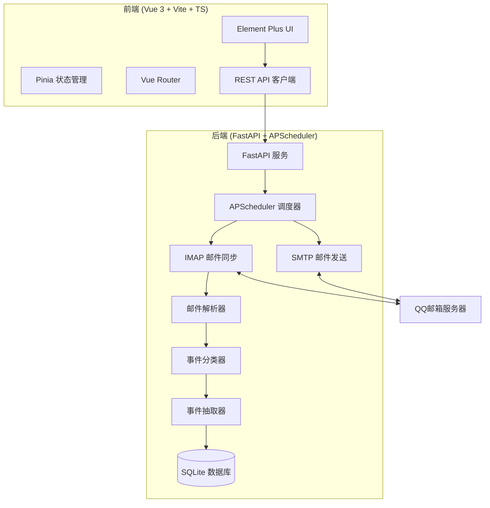

# QQ邮箱智能生活事件助手 - 实施计划

## 系统架构




## 一、后端项目结构

### 1.1 目录结构

```
backend/
├── app/
│   ├── api/              # API 路由
│   │   ├── __init__.py
│   │   ├── emails.py    # 邮件相关 API
│   │   ├── events.py    # 事件相关 API
│   │   ├── reminders.py # 提醒相关 API
│   │   └── system.py    # 系统状态 API
│   ├── db/
│   │   ├── __init__.py
│   │   ├── models.py    # SQLAlchemy 模型
│   │   └── database.py  # 数据库连接
│   ├── imap/
│   │   ├── __init__.py
│   │   ├── client.py    # IMAP 客户端
│   │   └── sync.py      # 邮件同步逻辑
│   ├── mailer/
│   │   ├── __init__.py
│   │   └── sender.py    # SMTP 发送器
│   ├── parser/
│   │   ├── __init__.py
│   │   ├── extractor.py # MIME 解析
│   │   ├── cleaner.py   # HTML 清洗
│   │   └── analyzer.py  # 内容分析
│   ├── scheduler/
│   │   ├── __init__.py
│   │   ├── tasks.py     # 调度任务
│   │   └── manager.py   # 调度管理器
│   ├── classifier/
│   │   ├── __init__.py
│   │   ├── rules.py     # 关键词/正则规则
│   │   └── matcher.py   # 匹配器
│   ├── extractor/
│   │   ├── __init__.py
│   │   ├── rule_extractor.py  # 规则抽取
│   │   └── llm_extractor.py   # 大模型抽取
│   ├── schemas/
│   │   ├── __init__.py
│   │   ├── email.py     # 邮件 Schema
│   │   ├── event.py     # 事件 Schema
│   │   └── reminder.py  # 提醒 Schema
│   ├── core/
│   │   ├── __init__.py
│   │   ├── config.py    # 配置管理
│   │   └── security.py  # 安全工具
│   ├── main.py          # 应用入口
│   └── requirements.txt # 依赖
├── .env                 # 环境变量
└── data/                # 数据目录
```

### 1.2 核心模块设计

#### 1.2.1 配置管理 (app/core/config.py)

- 从 `.env` 加载配置
- QQ邮箱 IMAP/SMTP 配置
- OpenAI API 配置
- 调度间隔配置

#### 1.2.2 数据库模型 (app/db/models.py)

- `Email`: 原始邮件存储
- `Event`: 结构化事件
- `Reminder`: 提醒记录
- `SyncStatus`: 同步状态

#### 1.2.3 IMAP 客户端 (app/imap/client.py)

- IMAP + QQ邮箱授权码认证
- UID 增量拉取
- 邮件下载与存储

#### 1.2.4 邮件解析 (app/parser/)

- MIME 解析提取主题、发件人、时间、正文、附件
- BeautifulSoup + lxml 清洗 HTML
- 纯文本提取

#### 1.2.5 事件分类 (app/classifier/)

- 关键词规则匹配
- 发件域名匹配
- 正则表达式匹配
- 分类: 账单、预约、物流、出行、通知、其他

#### 1.2.6 事件抽取 (app/extractor/)

- 规则抽取: 时间、金额、订单号等
- LLM 抽取: Prompt + JSON Schema
- 时间标准化、金额格式化

#### 1.2.7 调度任务 (app/scheduler/tasks.py)

- 邮箱同步任务 (可配置间隔)
- 事件处理任务
- 提醒发送任务
- 每日摘要任务

## 二、前端项目结构

### 2.1 目录结构

```
frontend/
├── src/
│   ├── api/
│   │   ├── index.ts     # API 封装
│   │   ├── emails.ts    # 邮件 API
│   │   ├── events.ts    # 事件 API
│   │   └── system.ts    # 系统 API
│   ├── pages/
│   │   ├── Dashboard.vue    # 仪表盘
│   │   ├── Emails.vue       # 邮件列表
│   │   ├── Events.vue       # 事件列表
│   │   ├── EventDetail.vue  # 事件详情
│   │   ├── Reminders.vue    # 提醒计划
│   │   └── Logs.vue         # 系统日志
│   ├── stores/
│   │   ├── email.ts     # 邮件状态
│   │   ├── event.ts     # 事件状态
│   │   └── system.ts    # 系统状态
│   ├── router/
│   │   └── index.ts     # 路由配置
│   ├── App.vue
│   └── main.ts
├── index.html
├── vite.config.ts
├── tsconfig.json
├── package.json
└── .env
```

### 2.2 页面设计

- **仪表盘**: 邮箱接入状态、统计卡片、最近事件
- **邮件列表**: 分页展示、筛选、搜索
- **事件列表**: 按类型分类、时间线展示
- **事件详情**: 完整事件信息、原始邮件链接
- **提醒计划**: 提醒列表、编辑、删除
- **系统日志**: 操作日志、同步日志

## 三、实施步骤

### 第一阶段: 基础架构 (1-2天)

1. 创建后端项目结构
2. 配置 FastAPI + SQLAlchemy
3. 创建数据库模型
4. 配置 .env 文件

### 第二阶段: 邮件同步 (2-3天)

1. 实现 IMAP 客户端
2. 实现邮件同步任务
3. 实现邮件解析器
4. 实现 HTML 清洗

### 第三阶段: 事件处理 (2-3天)

1. 实现事件分类器
2. 实现规则抽取器
3. 实现 LLM 抽取器
4. 集成 OpenAI API

### 第四阶段: 提醒功能 (1-2天)

1. 实现 SMTP 发送器
2. 实现提醒任务
3. 实现每日摘要

### 第五阶段: 前端开发 (3-4天)

1. 创建 Vue 3 项目
2. 实现 API 客户端
3. 实现各页面
4. 集成 Element Plus

### 第六阶段: 集成测试 (1-2天)

1. 端到端测试
2. 性能优化
3. 部署配置

## 四、技术栈


| 层级  | 技术                                                       |
| --- | -------------------------------------------------------- |
| 后端  | Python 3.12, FastAPI, APScheduler, SQLAlchemy            |
| 邮件  | imaplib, email, BeautifulSoup, lxml                      |
| AI  | OpenAI API (GPT-4)                                       |
| 数据库 | SQLite                                                   |
| 前端  | Vue 3, Vite, TypeScript, Pinia, Vue Router, Element Plus |
| 发送  | smtplib, email                                           |


## 五、配置项 (.env)

```env
# QQ邮箱配置
QQ_EMAIL=your_email@qq.com
QQ_IMAP_HOST=imap.qq.com
QQ_IMAP_PORT=993
QQ_SMTP_HOST=smtp.qq.com
QQ_SMTP_PORT=465
QQ_AUTH_CODE=your_auth_code

# OpenAI 配置
OPENAI_API_KEY=your_openai_key
OPENAI_MODEL=gpt-4

# 应用配置
APP_HOST=0.0.0.0
APP_PORT=8001
SYNC_INTERVAL_MINUTES=15
LOG_LEVEL=INFO
```

## 六、API 接口设计


| 方法     | 路径                 | 说明     |
| ------ | ------------------ | ------ |
| GET    | /api/emails        | 邮件列表   |
| GET    | /api/emails/:id    | 邮件详情   |
| GET    | /api/events        | 事件列表   |
| GET    | /api/events/:id    | 事件详情   |
| GET    | /api/reminders     | 提醒列表   |
| POST   | /api/reminders     | 创建提醒   |
| DELETE | /api/reminders/:id | 删除提醒   |
| GET    | /api/system/status | 系统状态   |
| GET    | /api/system/logs   | 系统日志   |
| POST   | /api/system/sync   | 手动触发同步 |


